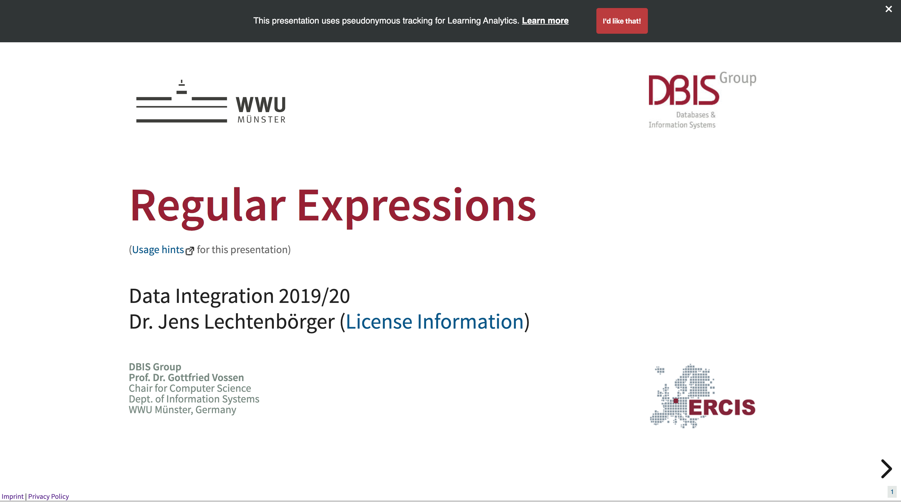

# reveal.js-tracking

## Table of Contents

- [Demo](#demo)
  - [Side Notes](#side-notes)
- [Usage](#usage)
  - [Basic Usage](#basic-usage)
    - [Pseudonymous Tracking](#pseudonymous-tracking)
      - [The Consent Banner](#the-consent-banner)
  - [Advanced Usage](#advanced-usage)
    - [Hints](#hints)
      - [Audios and Videos](#audios-and-videos)
      - [Quizzes](#quizzes)
    - [Default Configuration](#default-configuration)
  - [Request Body to Tracking API](#request-body-to-tracking-api)
- [License](#license)

This plug-in allows detailed tracking of interactions within a reveal.js
presentation. You are capable of defining to which API to send the tracking data
to. Tracked interactions are

- dwell times
- slide transitions
- clicking links
- playing and pausing media (audio recordings, videos)
- tracking quizzes

It also includes a configurable consent banner that respects the viewers'
privacy.

If you only want to track slide transitions (Reveal's `slidechanged` event) and
opening/closing of the overview (Reveal's `overviewshown` and `overviewhidden`
events) and send them to Google Analytics, try the plug-in
[reveal-ga](https://github.com/stevegrunwell/reveal-ga) instead.

## Demo

To view the demo of this plug-in, make sure you have Docker,
[docker-compose](https://github.com/docker/compose/releases), and
[grunt](https://gruntjs.com/getting-started) installed.

1. Install project dependencies with `npm install`
2. Build the containers with `docker-compose build`
3. And then fire up the API and the demo presentation with `docker-compose up`
4. Setup the database with `docker-compose run web bundle exec rake db:create` and `docker-compose run web bundle exec rake db:migrate`

On `http://localhost:8000`, you can enjoy the demo presentation.

The API is accessible via `http://localhost:4567`. If you wish to see your
latest tracking data from clicking through the demo presentation, simply visit
`http://localhost:4567/last-tracked`. Optionally, you can also supply the user
token that is saved in your cookies (the cookie key is `user_token`) or in your
HTML local storage (call `localStorage.getItem('user_token')`) for tracking your
demo presentation. Then, when accessing
`http://localhost:4567/last-tracked/your-user-token-goes-here`, you can see the
latest tracking data for that specific user in JSON format.

If you delete your localStorage and cookie, then you are treated as a new user.
Have fun!

### Side Notes

The API is a Sinatra application (see
[sinatra](https://github.com/sinatra/sinatra)). Thus, if you want to see further
tracking data of different users, you can use the Interactive Ruby Shell (irb)!

If the API is running in Docker, simply execute this to enter the `irb`:

```bash
docker-compose run web bundle exec irb -I. -r app.rb
```

There are two models with corresponding tables:

The `Student` model only has a field named `user_token` that it can be
identified with. Several `TrackedSession`s are associated to a `Student`.

If you have a user token you want tracking data for different sessions for,
simply type the following in the `irb`:

```ruby
# if you want a specific student
student = Student.find_by(user_token: 'your-user-token')
# if you want all students and select one from there
students = Student.all
student = students[3]

# get the tracked sessions for the student
tracked_sessions = student.tracked_sessions.order(created_at: :asc)

# or if you want all tracked sessions and go from there
tracked_sessions = TrackedSession.all
```

Then, to retrieve the tracking data for a specific session, use the Array
accessor for the variable `tracked_sessions` (e.g. `tracked_sessions[2]` for the
third session in that Array) and call this:

```ruby
# for the most recent one
tracked_sessions.last.tracking_json

# for the oldest one
tracked_sessions.first.tracking_json

# to get the length of the Array
tracked_sessions.size

# for any other session (here, the fourth)
tracked_sessions[3].tracking_json
```

If you want to copy the JSON and view it in an editor, you can convert this to a
JSON string:

```ruby
tracked_sessions[3].tracking_json.to_json
```

## Usage

### Basic Usage

Simply download this folder – you only need the `tracking.css` in the `css`
folder and `tracking.js` in the `js` folder – and add it to your reveal.js
presentation's plug-in directory, so your directory structure looks like this:

```tree
├── plugin
│   ├── ... (other plugins)
│   ├── tracking
│   │   ├── css
│   │   │   ├── tracking.css
│   │   ├── js
│   │   │   ├── tracking.js
│   ├── ... (other plugins)
```

When initializing `Reveal`, add this plug-in as a dependency:

```javascript
Reveal.initialize({
  ...,
  dependencies: [
    ...,
    { src: 'plugin/tracking/js/tracking.js', async: false },
    ...
  ],
  ...
});
```

For the configuration of this plug-in, add a `tracking` section to your
reveal.js configuration:

```javascript
Reveal.initialize({
  ...,
  tracking: {
    apiConfig: {
      authenticationAPI: {
        // configure the API where to request a user token from
        requestTokenEndpoint: 'https://my.platform/api/authentication/generate-token',
      },
      // configure where to send the tracked data
      trackingAPI: 'https://my.platform/api/tracking',
    },
    // configure the consent banner
    consentBanner: {
      infoText: 'This presentation uses pseudonymous tracking for Learning Analytics.',
      moreLink: {
        href: 'https://my.platform/privacy',
      },
    },
    // track dwell times
    dwellTime: true,
    // track link visits
    links: true,
    // track media interactions
    media: true,
    // track slide transitions
    slideTransitions: true,
    // track events from other reveal.js plug-ins
    revealDependencies: {
      // track events from reveal.js-quiz plug-in
      quiz: true,
    },
  },
  ...
});
```

#### Pseudonymous Tracking

In order to be able to associate multiple tracked sessions for one person, a
token is requested from an authentication API via `POST`
(`tracking.apiConfig.authenticationAPI.requestTokenEndpoint`). This token is
then sent with every tracked session to the tracking API. This token is stored
in both a cookie and the HTML local storage for next sessions. Thus, the real
user remains anonymous while the tracked data has an increased value.

This plug-in also allows to set a
`tracking.apiConfig.authenticationAPI.validateTokenEndpoint`. This is used when
a user token already exists in a cookie or the local storage. The existing token
is sent via `POST` in the request body (`{ user_token: 'a-nice-user-token' }`)
to this endpoint and expects a result like this:

```jsonc
{
  "valid": true, // or false, depending on whether the token is valid or not.
}
```

If the API deems the token as invalid, a new token is requested. This mechanism
ensures that the cookie was not manually generated and still exists on the
platform the associated tracking data is sent to.

Also, this mechanism allows the expiration of a token if desired.

It is also possible to leave out the `validationTokenEndpoint` although it is
not recommended.

The `generateTokenEndpoint` (thus, the entire `authenticationAPI` option) option
can be left out as well. The plug-in will work despite these options not being
set and send tracking data to the tracking API. However, since no user token
will be sent with each tracking request, the data collected will be completely
anonymous.

##### The Consent Banner

The consent banner is displayed at the top of the presentation if enabled:



Any styles, HTML classes and texts for the consent banner can be configured. See
[Advanced Usage](#advanced-usage).

The person gives her consent by clicking on the button "I'd like that!". If so,
the user token is requested from the authentication API if this options is
enabled. If not, the given consent is saved: Only with a given consent will the
plug-in send data to the tracking API (don't worry, any data is tracked
client-side prior to the consent being given nonetheless).

If you have an own consent banner, you can disable this one:

```javascript
{
  ...,
  tracking: {
    ...,
    consentBanner: false,
    ...
  },
  ...
}
```

But keep in mind, that you have to tell this plug-in when a consent has been
given. Simply do that by calling:

```javascript
Reveal.getPlugin('tracking').giveConsent();
```

or to remove the consent:

```javascript
Reveal.getPlugin('tracking').removeConsent();
```

### Advanced Usage

Here are list of configuration options with their defaults:

| configuration option                                | default value                                                            | explanation                                                                                                                                                                                     |
|-----------------------------------------------------|--------------------------------------------------------------------------|-------------------------------------------------------------------------------------------------------------------------------------------------------------------------------------------------|
| `apiConfig.authenticationAPI.validateTokenEndpoint` | `undefined`                                                              | *optional*: API URL to validate existing user token                                                                                                                                       |
| `apiConfig.authenticationAPI.generateTokenEndpoint` | `undefined`                                                              | *optional*: API URL to request user token from                                                                                                                                            |
| `apiConfig.trackingAPI`                             | `undefined`                                                              | API URL where to transmit tracking data to                                                                                                                                                      |
| `consentBanner.closeButton`                         | `{ class: 'content-banner--close', text: '&times;' }`                    | configuration for close button of consent banner                                                                                                                                                |
| `consentBanner.consentButton`                       | `{ class: 'content-banner--button', text: 'I\'d like that!' }`           | configuration for consent button of consent banner                                                                                                                                              |
| `consentBanner.infoText`                            | `'This presentation uses pseudonymous tracking for Learning Analytics.'` | info text for consent banner                                                                                                                                                                    |
| `consentBanner.moreLink`                            | `{ class: 'consent-banner--more-link', text: 'Learn more' }`             | configuration for 'Learn more' link of consent banner (**The `href` option is necessary if the consent banner is enabled**)                                                                     |
| `dwellTimes`                                        | `true`                                                                   | whether to track dwell times. You can configure whether to track dwell times per slide and total dwell time by setting `dwellTimes.perSlide` and `dwellTimes.total` to `true` or `false`        |
| `links`                                             | `true`                                                                   | whether to track clicks on links. You can configure whether to track clicks on internal links (pointing to slides) and external links by setting `links.internal` and `links.external` to `true` or `false` |
| `media`                                             | `true`                                                                   | whether to track interactions on audios and videos. You can configure whether to track interactions on audios and videos by setting `media.audio` and `media.video` to `true` or `false`        |
| `slideTransitions`                                  | `true`                                                                   | whether to track slide transitions                                                                                                                                                              |
| `revealDependencies.quiz`                           | `false`                                                                  | whether to track events in reveal.js plug-in [reveal.js-quiz](https://gitlab.com/schaepermeier/reveal.js-quiz)                                                                                  |

#### Hints

##### Audios and Videos

If you want to track audio and video events (play/pause), both video and audio
tags need a DOM ID in this format:

```javascript
/(audio|video)player-%horizontalIndex%-%verticalIndex%(-%mediaIndex%)?>/
```

For instance, on a slide with a horizontal index of 4 and a vertical index of 2,
the second audio file has the following ID: `audioplayer-4-2-1`. (The
`mediaIndex` starts at `0`.)

The plug-in
[audio-slideshow](https://github.com/rajgoel/reveal.js-plugins/tree/master/audio-slideshow)
does that automatically for audios.

For videos you need to this manually.

##### Quizzes

If you want to track quizzes, here are the conditions:

- this plug-in needs to be in the `dependencies` section *after* the quiz
  plug-in
- when adding the quiz plug-in to the `dependencies`, do not set `async` to
  `true` and do not provide the `callback`. Simply put: `{ src: 'plugin/quiz/quiz.js' }`
  before `{ src: 'plugin/tracking/tracking.js' }`
- instead, provide the configuration options for the quiz plug-in in a `quiz`
  section when initializing reveal.js:

```javascript
Reveal.initialize({
  ...,
  dependencies: [
    ...,
    { src: 'plugin/quiz/quiz.js' },
    { src: 'plugin/tracking/tracking.js' },
    ...,
  ],
  ...,
  tracking: ...,
  quiz: {
    ...,
    preventUnanswered: true,
    skipStartButton: false,
  }
});
```

- make sure that the option `skipStartButton` is set to `false`. Otherwise the
  start event cannot be tracked

#### Default Configuration

```javascript
{
  apiConfig: {},
  consentBanner: {
    closeButton: {
      class: 'consent-banner--close',
      text: '&times;',
    },
    consentButton: {
      class: 'consent-banner--button',
      text: 'I\'d like that!',
    },
    infoText: 'This presentation uses pseudonymous tracking for Learning Analytics.',
    moreLink: {
      class: 'consent-banner--more-link',
      text: 'Learn more',
    },
  },
  dwellTimes: true,
  links: true,
  media: true,
  slideTransitions: true,
  revealDependencies: {
    quiz: false,
  },
}
```

### Request Body to Tracking API

This is a sample request body in JSON format that is be sent to the tracking
API. There is only one request per session and this is sent when the user closes
the presentation (event `window.onpagehide`).

```jsonc
{
  // the user token
  "userToken": "a-nice-user-token",
  // presentation Url to identify the lecture
  "presentationUrl": "https://my.presentation/current-lecture",
  // total number of slides in the presentation
  "totalNumberOfSlides": 29,
  // progress in presentation when the user closed the presentation (between 0 and 1). can be float or integer
  "finalProgress": 0.67823128904,
  // total dwell time in the presentation
  "totalDwellTime": "01:30:59",
  // list of dwell times per slide
  "dwellTimes": [
    {
      "type": "dwellTimePerSlide",
      "dwellTime": "00:00:15",
      "slideData": {
        "slideNumber": 1,
        "horizontalIndex": 0,
        "verticalIndex": 0
      }
    },
    {
      "type": "dwellTimePerSlide",
      "dwellTime": "00:00:08",
      "slideData": {
        "slideNumber": 2,
        "horizontalIndex": 1,
        "verticalIndex": 0
      }
    },
    {
      "type": "dwellTimePerSlide",
      "dwellTime": "00:05:02",
      "slideData": {
        "slideNumber": 3,
        "horizontalIndex": 1,
        "verticalIndex": 1
      }
    },
    {
      "type": "dwellTimePerSlide",
      "dwellTime": "00:06:09",
      "slideData": {
        "slideNumber": 4,
        "horizontalIndex": 1,
        "verticalIndex": 2
      }
    },
    ...
  ],
  // detailed timeline of events
  "timeline" : [
    {
      "type": "slideTransition",
      "previousSlide": {
        "slideNumber": 1,
        "horizontalIndex": 0,
        "verticalIndex": 0
      },
      "currentSlide": {
        "slideNumber": 2,
        "horizontalIndex": 1,
        "verticalIndex": 0
      },
      "timestamp": "00:00:15"
    },
    {
      "type": "slideTransition",
      "previousSlide": {
        "slideNumber": 2,
        "horizontalIndex": 1,
        "verticalIndex": 0
      },
      "currentSlide": {
        "slideNumber": 3,
        "horizontalIndex": 1,
        "verticalIndex": 1
      },
      "timestamp": "00:00:23"
    },
    {
      "type": "externalLink",
      "timestamp": "00:04:20",
      "metadata": {
        "href": "https://github.com/hakimel/reveal.js",
        "linkText": "reveal.js"
      },
      "slideData": {
        "slideNumber": 3,
        "horizontalIndex": 1,
        "verticalIndex": 1
      }
    },
    {
      "type": "audio",
      "mediaEvent": "play",
      "timestamp": "00:03:12",
      "metadata": {
        "id": "audioplayer-3-1-0",
        "mediaSource": "https://my.presentation/audios/help01.ogg"
      },
      "slideData": {
        "slideNumber": 3,
        "horizontalIndex": 1,
        "verticalIndex": 1,
        "mediaIndex": 0
      }
    },
    {
      "type": "audio",
      "mediaEvent": "pause",
      "finished": true,
      "progress": 1,
      "timestamp": "00:03:15",
      "metadata": {
        "id": "audioplayer-3-1-0",
        "mediaSource": "https://my.presentation/audios/help01.ogg"
      },
      "slideData": {
        "slideNumber": 3,
        "horizontalIndex": 1,
        "verticalIndex": 1,
        "mediaIndex": 0
      }
    },
    {
      "type": "slideTransition",
      "previousSlide": {
        "slideNumber": 3,
        "horizontalIndex": 1,
        "verticalIndex": 1
      },
      "currentSlide": {
        "slideNumber": 4,
        "horizontalIndex": 1,
        "verticalIndex": 2
      },
      "timestamp": "00:05:25"
    },
    {
      "type": "quiz",
      "quizEvent": "start",
      "timestamp": "00:05:45",
      "metadata": {
        "id": "firstQuiz",
        "name": "Test your knowledge!",
        "topic": "What is reveal.js?",
        "numberOfQuestions": 3
      },
      "slideData": {
        "slideNumber": 4,
        "horizontalIndex": 1,
        "verticalIndex": 2
      }
    },
    {
      "type": "quiz",
      "quizEvent": "complete",
      "dwellTime": "00:05:00",
      "completed": true,
      "score": 2,
      "timestamp": "00:10:45",
      "metadata": {
        "id": "firstQuiz",
        "name": "Test your knowledge!",
        "topic": "What is reveal.js?",
        "numberOfQuestions": 3
      },
      "slideData": {
        "slideNumber": 4,
        "horizontalIndex": 1,
        "verticalIndex": 2
      }
    },
    ...
  ]
}
```

## License

MIT licensed

Copyright (C) 2020 Joe Pantazidis
